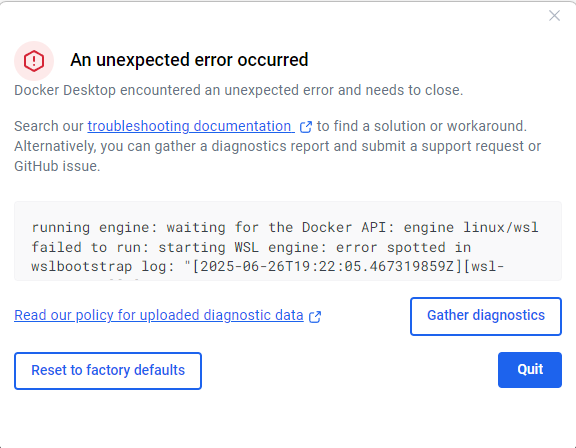

# 🎮 Projet Market Pokémon - Collection de Cartes

## 📝 Description du Projet

Salut ! Voici notre projet de fin de semestre : une application web pour gérer une collection de cartes Pokémon. 

L'idée c'est de créer un marché virtuel où les utilisateurs peuvent :
- Voir des cartes Pokémon avec leurs sprites officiels
- Acheter des cartes avec de l'argent virtuel
- Gérer leur collection personnelle
- Découvrir de nouveaux Pokémons 

## 🛠️ Technologies Utilisées

**Backend :**
- Java
- Spring Boot 
- Spring Data JPA
- Base de données H2 (pour les tests) 
- Je n'ai pas réussi à utiliser Docker et postgresql pour faire persister la database. A chaque fois que je lancais docker j'avais une erreur.

**Frontend :**
- HTML5, CSS3, JavaScript vanilla

**API Externe :**
- PokéAPI pour récupérer les données des Pokémons

## 🏗️ Architecture du Projet

J'ai organisé le code en MIcro-services:

```
src/main/java/com/example/demo/
├── pokemon/          # Domaine Pokémon
│   ├── entity/       # Entités JPA
│   ├── dto/          # Objets de transfert
│   ├── repository/   # Accès aux données
│   ├── service/      # Logique métier
│   ├── mapper/       # Conversion entité/DTO
│   └── controller/   # API REST
├── user/             # Domaine Utilisateur
│   └── [même structure]
├── market/           # Domaine Marché
│   └── [même structure]
└── controller/       # Controllers de compatibilité
```

## 🚀 Comment Lancer le Projet

### Prérequis
- Java 17+ 
- Maven 3.6+

### Installation

1. **Cloner le repo :**
   ```bash
   git clone https://github.com/salsinats1/ProjetPokemon.git
   cd ProjetPokemon/demo
   ```

2. **Compiler et lancer :**
   ```bash
   mvn spring-boot:run
   ```

3. **Ouvrir dans le navigateur :**
   ```
   http://localhost:8080
   ```

> **Note :** Si le port 8080 est occupé, l'application se lancera automatiquement sur un autre port (8081, 8082, etc.)

## 📱 Utilisation

### Page Principale
- Affiche les cartes Pokémon disponibles
- Bouton "Charger plus de Pokémons" pour ajouter de nouvelles cartes
- Chaque carte montre : nom, sprite, types, statistiques

### Espace Utilisateur
- Connexion/inscription (interface prête, backend en cours)
- Gestion de la collection personnelle
- Système d'achat avec argent virtuel

## 🎨 Interface

J'ai choisi un thème sombre.

## 📊 API Endpoints

### Pokémons
- `GET /api/cartes` - Liste toutes les cartes
- `POST /api/cartes/charger-pokemons` - Charge de nouveaux Pokémons
- `GET /api/pokemons/{id}` - Détails d'un Pokémon
- `GET /api/pokemons/type/{type}` - Pokémons par type

### Utilisateurs (en développement)
- `POST /api/users/{userId}/acheter/{carteId}` - Acheter une carte
- `GET /api/users/{userId}/collection` - Collection de l'utilisateur

## 🔧 Fonctionnalités Implémentées

✅ Affichage des cartes Pokémon avec données de l'API  
✅ Interface responsive avec thème sombre  
✅ Architecture Microservice propre et maintenable  
✅ Chargement dynamique de nouveaux Pokémons  
✅ API REST documentée  

## 🚧 À Venir

- 🔐 Système d'authentification complet
- 💰 Gestion des transactions et économie du jeu
- 📈 Statistiques de collection avancées
- 🎲 Système de packs de cartes aléatoires

## 🐛 Problèmes Connus

- Le cache CSS peut parfois poser problème (Ctrl+F5 pour forcer le rechargement)
- L'authentification est en interface seulement pour l'instant

## 📚 Ce que j'ai Appris

- Architecture en couches avec Spring Boot
- Consommation d'APIs externes
- Mapping objet-relationnel avec JPA
- Organisation du code selon microservice
- Responsive design et CSS avancé

## 👨‍🎓 Auteurs
SASSOLAS Stanislas
VAULOT Pierre

---

*Dernière mise à jour : Juin 2025*
